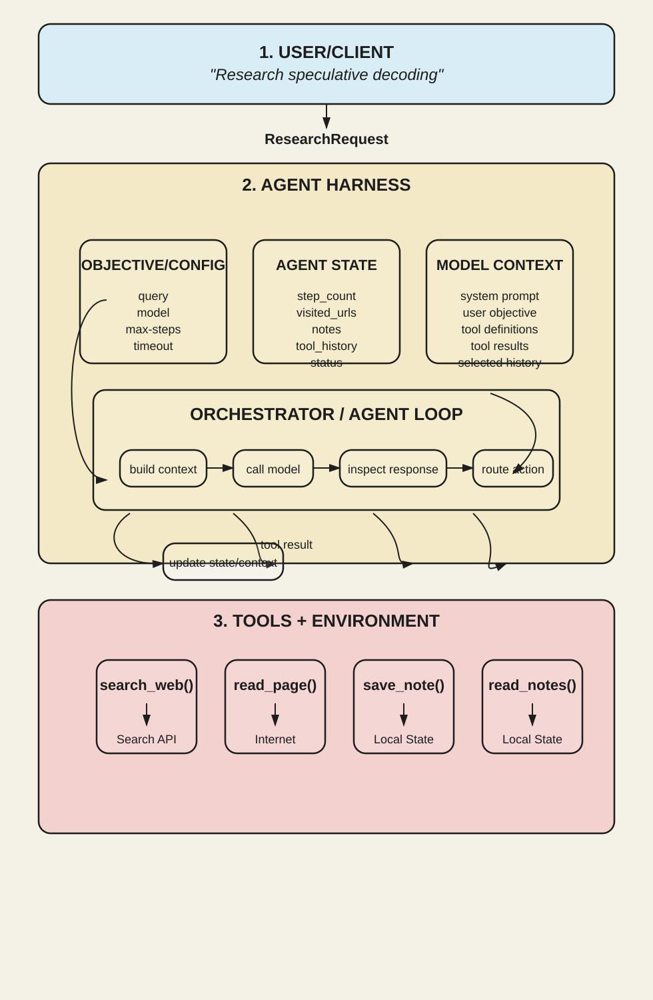

# Research Agent

A lightweight research agent being built from scratch to understand the infrastructure that turns a language model into an agent.

The current implementation includes a Python CLI, validated request and config
objects, mutable agent state, immutable model context, structured actions, four
executable tools, and a complete deterministic agent loop. The model is still a
scripted teaching stand-in rather than a live LLM.

Rather than relying on an agent framework, this project is implementing the core
agent harness one layer at a time: model invocation, state and context
management, tool execution, validation, and the iterative agent loop.

The CLI accepts a research objective such as:

> "Research speculative decoding"

The current script demonstrates the full control flow without claiming to
research the objective. A later live-model adapter will make the tool choices.

## Architecture



The system separates the **model** from the **harness that controls its
execution**.

The harness maintains three core components:

- **Objective / Config** — defines the research query, model, step limit, and timeout.
- **Agent State** — tracks information accumulated during execution, including visited URLs, notes, tool history, and current status.
- **Model Context** — contains the information exposed to the model on each invocation, including instructions, available tools, relevant history, and previous tool results.

The orchestrator now runs the core agent loop:

`build context → call model → inspect response → route action → execute tool → update state → repeat`

The model requests a **tool call** or indicates that it has finished. Tool calls
are validated by the harness before execution, ensuring the requested tool
exists, its arguments are valid, and it is safe to run.

## Tools

The registry now has four tools:

- `search_web()` — discover relevant sources
- `read_page()` — retrieve and inspect a source
- `save_note()` — persist useful research findings
- `read_notes()` — retrieve accumulated findings

The model chooses **what it wants to do**, while the harness determines **what
is actually executed**. The current CLI script deliberately exercises only the
local note tools, so it never performs network research.

## Why Build It From Scratch?

Agent frameworks abstract away much of the machinery that makes an LLM agentic.
This project intentionally builds that machinery directly to explore how models
interact with tools, how state and context flow through a loop, and how a harness
can govern execution safely.

## Status

🚧 Work in progress.

## First Milestone: Python CLI

The first implementation step was a dependency-free Python CLI for accepting a
research objective and its limits. Those limits now control the agent loop.

Requirements: Python 3.11 or newer.

```bash
python3 -m research_agent "Research speculative decoding"
```

You can inspect all available options with:

```bash
python3 -m research_agent --help
```

Run the tests with:

```bash
python3 -m unittest discover -s tests -v
```

At this milestone, the CLI only validated and displayed the request. It now runs
the scripted loop described in milestone five.

## Second Milestone: Agent State

`AgentState` now tracks the changing information for one run: its step count,
visited URLs, notes, tool history, and lifecycle status. Each run receives its
own collections so data cannot leak between separate agent runs.

## Third Milestone: Agent Actions

The model can now propose one of two structured actions. `ToolCall` asks the
harness to run a named tool with a dictionary of arguments. `FinishAction`
signals that the model is done and supplies its final answer. These objects only
describe requests; they never execute a tool themselves.

## Fourth Milestone: Tool Registry and Tools

`ToolRegistry` is an explicit allow-list that dispatches known `ToolCall`
objects and returns structured `ToolResult` observations. It translates expected
input and network failures into safe error results while allowing programming
bugs to remain visible.

The four implemented tools are:

| Tool | Arguments | Effect |
| --- | --- | --- |
| `save_note` | `note` | Validates and appends one note to `AgentState` |
| `read_notes` | none | Returns the current notes in order |
| `search_web` | `query`, optional `max_results` | Searches through Brave Web Search |
| `read_page` | `url`, optional `max_chars` | Fetches and extracts public page text |

All four tools are Python library APIs. The scripted CLI reaches `save_note` and
`read_notes` through the same registry that a future live model will use. You can
also call those tools directly without an API key or network connection:

```python
from research_agent.actions import ToolCall
from research_agent.state import AgentState
from research_agent.tools import build_default_registry

registry = build_default_registry()
state = AgentState()

registry.execute(
    ToolCall("save_note", {"note": "Speculative decoding uses a draft model."}),
    state,
)
result = registry.execute(ToolCall("read_notes"), state)
print(result.output)
```

`search_web` uses the
[Brave Search API](https://api-dashboard.search.brave.com/documentation/guides/authentication).
Export the key in your shell before making a live search request:

```bash
export BRAVE_SEARCH_API_KEY="your-key-here"
```

The project does not automatically load `.env` files. `.env.example` documents
the variable name, and `.env` is ignored so secrets are not committed.

`read_page` accepts only public HTTP or HTTPS destinations on their default
ports. It pins the connection to a vetted DNS result, revalidates redirects,
blocks HTTPS downgrades and non-public addresses, caps response and output size,
and accepts only readable text content. Retrieved text is explicitly labeled as
untrusted content.

The dependency-free reader applies socket timeouts while connecting and reading,
but Python's standard-library DNS lookup and a server that continuously sends
tiny chunks cannot be given a strict whole-operation deadline here. A production
deployment should add an egress-restricted proxy or process-level watchdog around
the fetcher.

All automated tests use injected fake search and page backends, so the suite
does not require a key or network access.

## Fifth Milestone: Scripted Model and Orchestrator

The CLI now performs a complete offline run in three loop iterations:

1. The scripted model requests `save_note`, which the registry validates and
   executes.
2. The updated context includes that observation; the model requests
   `read_notes`, which the registry executes.
3. The next context includes both tool results; the model returns
   `FinishAction`, and the run becomes `FINISHED`.

```bash
python3 -m research_agent "Research speculative decoding"
```

The trace shows every model action, tool observation, final answer, and run
summary. It clearly labels the result as a scripted demo and states that no
external research was performed.

One step means one attempted model call. The runner enforces the configured step
limit and a cooperative monotonic deadline, returns expected tool failures to the
model as observations, and ensures every exit ends in either `FINISHED` or
`FAILED`. For example, this intentionally stops before the three-step script can
finish:

```bash
python3 -m research_agent "Research speculative decoding" --max-steps 2
```

That intentional safety stop writes its trace to standard error and exits with
code 1; it is a demonstration rather than a broken command.

Model contexts are immutable snapshots rather than references to live state.
History, notes, visited URLs, individual tool output, and cumulative context are
bounded so repeated calls cannot grow the next prompt without limit.

The next milestone is a live-model adapter with explicit tool schemas and a
strict parser that converts model output into `ToolCall` or `FinishAction`.
