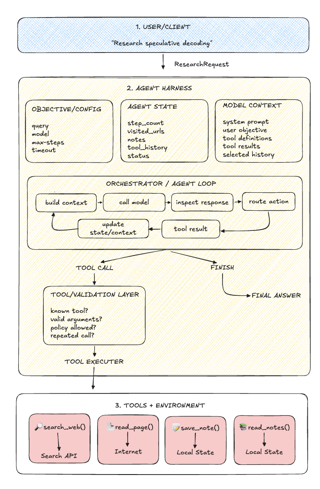

# Research Agent

A dependency-free Python research-agent harness built from scratch to show how
a model, tools, state, and an agent loop work together.

The current CLI uses a deterministic scripted model. It demonstrates the full
control flow without claiming to perform live research or calling a model API.

## Architecture



The harness follows a simple loop:

`build context → call model → validate action → run tool → record result → repeat`

It includes immutable model contexts, structured tool calls, an allow-listed
tool registry, run history, step and timeout limits, and safe failure handling.

## Run the CLI

Requires Python 3.11 or newer. From the repository root:

```bash
python3 -m research_agent "Research speculative decoding"
```

See the available options:

```bash
python3 -m research_agent --help
```

The scripted demo calls `save_note`, calls `read_notes`, and then finishes. Its
terminal trace shows each action, observation, final answer, and run summary.

## Tools

| Tool | Purpose |
| --- | --- |
| `search_web` | Find sources with Brave Search |
| `read_page` | Read text from a public web page |
| `save_note` | Store a research finding in agent state |
| `read_notes` | Return the saved findings |

The CLI demo uses only the local note tools. To use `search_web` through the
Python API, set a Brave Search API key in your shell:

```bash
export BRAVE_SEARCH_API_KEY="your-key-here"
```

`read_page` validates destinations, blocks private network addresses, checks
redirects, and caps downloaded and extracted content.

## Tests

The test suite uses fake network backends, so it needs no API key or internet
connection:

```bash
python3 -m unittest discover -s tests -v
```
